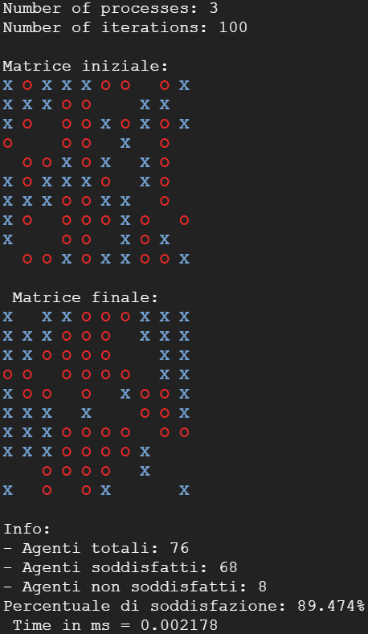

# Modello di segregazione di Schelling
**SchellingsModelMPI** è stato creato per il corso di **Programmazione Concorrente, Parallela e su Cloud** usando il linguaggio **C** e la libreria **Open MPI**.
- Studente: **Triggiani Giulio**
- Matricola: **0522501328**
- Data: **gg/mm/aaaa**

## Sommario
- [Descrizione del problema](#descrizione-del-problema)
	- [Segregazione spaziale](#segregazione-spaziale)
	- [Modello di Schelling](#modello-di-schelling)
- [Descrizione della soluzione](#descrizione-della-soluzione)
	- [Inizializzazione della matrice](#inizializzazione-della-matrice)
	- [Suddivisione della matrice](#suddivisione-della-matrice)
	- [Calcolo della soddisfazione](#calcolo-della-soddisfazione)
	- [Calcolo posizione celle vuote e condivisione tra i processi](#calcolo-posizione-celle-vuote-e-condivisione-tra-i-processi)
	- [Spostamento degli agenti insoddisfatti](#spostamento-degli-agenti-insoddisfatti)
	- [Calcolo della soddisfazione totale e presentazione dei risultati ottenuti](#calcolo-della-soddisfazione-totale-e-presentazione-dei-risultati-ottenuti)
	- [Flusso di esecuzione](#flusso-di-esecuzione)
- [Istruzioni per eseguire](#istruzioni-per-eseguire)
	- [Compilazione](#compilazione)
	- [Esecuzione](#esecuzione)
- [Correttezza](#correttezza)
- [Benchmarks](#benchmarks)
	- [Nozioni sui benchmarks](#nozioni-sui-benchmarks)
	- [Test](#test)
	- [Discussione dei risultati](#discussione-dei-risultati)
- [Conclusioni](#conclusioni)

## Descrizione del Problema
Il seguente progetto si pone l'obiettivo di realizzare una simulazione del modello di **segregazione di Schelling**, è scritto in linguaggio **C** e fa uso della libreria **Open MPI** (Message Passing Interface).

La segregazione razziale è sempre stata un problema sociale molto sentito negli Stati Uniti ed in generale nel mondo. Molti sono i fattori che hanno contribuito alla sua diffusione, tra cui il pregiudizio, la discriminazione religiosa, di genere ed economica. Sebbene siano stati compiuti molti sforzi per desegregare le scuole, le chiese e i quartieri, il mondo continua a rimanere segregato per motivi razziali, economici o religiosi.

### Segregazione spaziale
La **segregazione spaziale** è un fenomeno sociale che consiste nell'occupazione, da parte di diversi gruppi umani, di aree spaziali collocate all'interno di determinati orizzonti geopolitici, come un'area urbana, un paese, una regione o uno stato, sulla base esclusivamente di preferenze soggettive.

### Modello di Schelling
Nel **1971** l'economista americano **Thomas Schelling** creò un modello basato su **agenti** che suggeriva che anche il comportamento involontario potesse contribuire alla **segregazione**. Il suo modello di segregazione mostrava che, anche quando agli individui (o "agenti") non importava essere circondati o vivere con agenti di razza o background economico diverso, essi sceglievano comunque di segregarsi da altri agenti nel corso del tempo.

Un semplice modello di Schelling si basa su una matrice le cui celle posso essere occupate da agenti o essere vuote. Un agente si ritiene soddisfatto quando è circondato da almeno *t*% di agenti simili a lui, dove con *t* si indica la percentuale di agenti simili a lui nelle 8 celle adiacenti. Più la percentuale sarà alta più sarà difficile accontentare tutti gli agenti, una percentuale accettabile può essere 30%. Anche se molto semplicistico questo modello mostra come basti che le persone coltivino una banale preferenza di qualche tipo, (come economica, sociale o raziale) per portare ad un fenomeno di segregazione.
| Animazione del modello di Schelling |
| :---------------------------------: |
|  |

## Descrizione della soluzione
La soluzione proposta segue **6 passi di computazione** che permettono di simulare il modello.

1. Inizializzazione della matrice
2. Suddivisione della matrice
3. Calcolo della soddisfazione degli agenti
4. Calcolo della posizione delle celle vuote e condivisione tra i processi
5. Spostamento degli agenti insoddisfatti
6. Calcolo della soddisfazione totale e presentazione dei risultati ottenuti

> I punti 3, 4 e 5 vengono ripetuti più volte.

### Inizializzazione della matrice
Il master inizializza la matrice usando le costanti presenti all'interno del codice, di default hanno questi valori:

    
    #define ROWS 100                // Numero di righe della matrice
    #define COLUMNS 100             // Numero di colonne della matrice
    #define AGENT_X 'X'             // Agente 'X'
    #define AGENT_O 'O'             // Agente 'O'
    #define EMPTY ' '               // Casella vuota
    #define X_PERCENTAGE 30         // Percentuale di agenti 'X' nella matrice
    #define O_PERCENTAGE 30         // Percentuale di agenti 'O' nella matrice
    #define SAT_PERCENTAGE 33.333   // Percentuale di soddisfazione di un agente
    #define MAX_STEP 100            // Massimo numero di iterazioni
 
Il master inserisce un agente nella matrice in base ad un numero casuale compreso tra **0** e **99** con queste regole:
- Se il numero casuale è compreso tra 0 e la percentuale di agenti 'O', allora nella matrice si mette un agente 'O'.
- Se il numero casuale è compreso tra la percentuale di agenti 'O' e la somma della percentuale di agenti 'O' e 'X', allora nella matrice si mette un agente 'X'.
- Se il numero casuale è compreso tra la somma di agenti 'O' e 'X' e 100, allora la cella della matrice rimane vuota.

Come si può vedere qui:

    if ((random >= 0) && (random < O_pct)) {
	    (matrix + (row * COLUMNS) + column) = AGENT_O;
	}
	
	if ((random >= O_pct) && (random < O_pct + X_pct)) {
		(matrix + (row * COLUMNS) + column) = AGENT_X;
	}
	
	if ((random >= O_pct + X_pct) && (random < 100)) {
		(matrix + (row * COLUMNS) + column) = EMPTY;
	}

### Suddivisione della matrice
I processi calcolano quante righe dovranno ricevere, calcoleranno quindi il **numero di righe diviso il numero di processori**, se tale divisione produrrà un **resto** allora bisognerà assegnare delle righe in più ai processi.

Per contenere le righe dei processi adiacenti, ai processi con **rank > 0 ** e **rank < world-size - 1** (quelli "centrali") verranno assegnate **due righe**, mentre ai processi con **rank == 0** e **rank == world-size - 1** (quelli ai "confini") **una riga** sola. Questo sarà molto utile quando si dovranno scambiare le righe con i processi adiacenti per il calcolo della soddisfazione.

    int divisione = (ROWS) / (world_size);
    int resto = (ROWS) % (world_size);

    for (int i = 0; i < world_size; i++) {
	    sendcounts[i] = divisione * COLUMNS;
		rows_per_process[i] = divisione;
		
		if (resto > 0) {
			sendcounts[i] += COLUMNS;
			rows_per_process[i]++;
			resto--;
		}
		
		displacements[i] = displacement;
		displacement += sendcounts[i];
	
		rows_per_process[i] += (i == 0 || i == world_size - 1) ? 1 : 2;
	}

Ora la matrice verrà divisa tra i processi usando **MPI_Scatterv** in modo da poter gestire al meglio il carico di lavoro anche nel caso in cui bisogni assegnare più righe solo ad alcuni processi.

    MPI_Scatterv(matrix, sendcounts, displacements, MPI_CHAR, sub_matrix, rows_per_process[rank] * COLUMNS, MPI_CHAR, MASTER, MPI_COMM_WORLD);

### Calcolo della soddisfazione
Prima di calcolare la soddisfazione degli agenti i processi devono **scambiare** le righe ai "confini" della loro sottomatrice con i processi **adiacenti**.  Per farlo si fa uso di **comunicazione non bloccante** in modo da non rallentare troppo l'esecuzione.

    if (rank != 0) {
	    MPI_Isend(sub_matrix, COLUMNS, MPI_CHAR, neighbour_down, 99, communicator, &request_up);
	    MPI_Irecv(sub_matrix + neighbour_down_row_pos, COLUMNS, MPI_CHAR, neighbour_down, 99, communicator, &request_up);
	}
	
	if (rank != world_size - 1) {
		MPI_Isend(sub_matrix + my_last_row_pos, COLUMNS, MPI_CHAR, neighbour_up, 99, communicator, &request_down);
		MPI_Irecv(sub_matrix + neighbour_up_row_pos, COLUMNS, MPI_CHAR, neighbour_up, 99, communicator, &request_down);
		}

Ora siamo pronti per calcolare la soddisfazione degli agenti.
Il calcolo della soddisfazione **produce una matrice** di dimensioni uguali a quella della porzione di matrice assegnata al processo che sta calcolando la soddisfazione degli agenti. La nuova matrice sarà molto utile per determinare dove spostare gli agenti insoddisfatti.
La matrice utilizza **tre valori** per distinguere le tre possibilità:
- **0**: l'agente è  **soddisfatto** e quindi non dovrà essere spostato.
- **1**: l'agente **non è soddisfatto** e quindi dovrà essere spostato.
- **-1**: la cella è **vuota** e quindi potrà essere usata per ospitare un agente.

Un agente si ritiene soddisfatto se nelle 8 celle adiacenti ci sono almeno ***SAT_PERCENTAGE*** di agenti simili a lui. Questo valore può essere modificato prima dell'esecuzione del programma, ma si consiglia comunque di non superare il  40% in quanto potrebbe risultare complicato soddisfare un numero accettabile di agenti.

    for (int i = 0; i < 8; i++) {
	    if (neighbours[i] == current_element)
		    similar++;
		else  if (neighbours[i] == '\0')
			neighbours_count--;
	}
	
	if ((((double)100 / neighbours_count) * similar) >= SAT_PERCENTAGE)
		return  1;
	else
		return  0;

### Calcolo posizione celle vuote e condivisione tra i processi
Prima di poter spostare gli agenti insoddisfatti vanno calcolate le celle vuote.

    for (int i = 0; i < original_rows; i++)
	    for (int j = 0; j < COLUMNS; j++)
		    if (sub_matrix[i * COLUMNS + j] == EMPTY) {
			    voidCell temp = {(displacement + i * COLUMNS), j};
			    void_cells[ind] = temp;
			    ind++;
			 }

Una volta calcolate "quante celle vuote ha ogni processo" e la loro posizione, esse possono essere raggruppate, e per farlo viene usata la funzione **MPI_Allgatherv**.

    MPI_Allgatherv(local_void_cells, number_of_local_void_cells, datatype, global_void_cells, number_of_global_void_cells, displacements, datatype, MPI_COMM_WORLD);

A questo punto l'array con le posizioni di tutte le celle vuote viene mescolato per poi essere diviso tra i processi.
> I processi che non presentano più agenti insoddisfatti non riceveranno celle vuote.

    MPI_Scatterv(global_void_cells, void_cells_per_process, displacements, datatype, toReturn, void_cells_per_process[rank], datatype, MASTER, MPI_COMM_WORLD);

### Spostamento degli agenti insoddisfatti
A questo punto gli agenti insoddisfatti possono essere spostati.
Si presentano due possibilità:
1. La cella vuota a cui è destinato un agente insoddisfatto appartiene al suo **stesso processo**, allora l'agente viene direttamente spostato.

    if (receiver == rank) {
	    int startRow = displacements[rank];
	    int destRow = destination.row_index - startRow;
	    
	    sub_matrix[destRow + destination.column_index] = sub_matrix[i * COLUMNS + j];
	    sub_matrix[i * COLUMNS + j] = EMPTY;
	    
	    want_move[destRow + destination.column_index] = 0;
	    want_move[i * COLUMNS + j] = -1;
	}

2. La cella vuota a cui è destinato un agente appartiene ad un processo **diverso dal suo**, allora viene creata una matrice dove sulle righe sono presenti i processi e sulle colonne viene usata la struttura dati **moveAgent** che indica l'agente che vuole spostarsi e la cella di destinazione, sarà poi usata per spostare effettivamente l'agente.

    else {
	    int startRow = displacements[receiver];
	    int destRow = destination.row_index - startRow;
	    
	    moveAgent var = {destRow, destination.column_index, sub_matrix[i * COLUMNS + j]};
	    data[receiver][num_elems_to_send_to[receiver]] = var;
	    num_elems_to_send_to[receiver] += 1;
	    
	    sub_matrix[i * COLUMNS + j] = EMPTY;
	    want_move[i * COLUMNS + j] = -1;
	}

Infine bisogna sincronizzare i processi tra di loro per rendere gli spostamenti degli agenti in altri processi effettivi.

    synchronize(rank, world_size, num_elems_to_send_to, num_assigned_void_cells, data, original_rows, sub_matrix, move_agent_type);

### Calcolo della soddisfazione totale e presentazione dei risultati ottenuti
Alla fine dell'esecuzione la matrice viene ricomposta usando la funzione **MPI_Gatherv**

    MPI_Gatherv(sub_matrix, sendcounts[rank], MPI_CHAR, matrix, sendcounts, displacements, MPI_CHAR, MASTER, MPI_COMM_WORLD);

Vengono **deallocate** le risorse assegnate agli **MPI_Datatype**

    MPI_Type_free(&VOID_CELL_TYPE);
    MPI_Type_free(&MOVE_AGENT_TYPE);
    MPI_Finalize();

Viene quindi calcolata la soddisfazione totale facendo una media tra gli agenti sodisfatti e quelli totali.

    float average = ((double)satisfied_agents / (double)total_agents) * 100;

### Flusso di esecuzione
Il seguente flusso di esecuzione mostra in maniera schematica l'esecuzione dei vari punti citati.
| Flusso di esecuzione |
| :------------------: |
|  |

## Istruzioni per eseguire
Per eseguire il codice bisogna prima **compilarlo** e poi **eseguirlo**, ma prima di farlo è possibile modificare dei parametri al suo interno, essi sono:

    #define ROWS 100
    #define COLUMNS 100
    #define AGENT_X 'X'
    #define AGENT_O 'O'
    #define EMPTY ' '
    #define X_PERCENTAGE 30
    #define O_PERCENTAGE 30
    #define SAT_PERCENTAGE 33.333
    #define MAX_STEP 100

- **ROWS** e **COLUMNS** modificano il numero di righe e colonne della matrice.
- **AGENT_X** e **AGENT_O** modificano il simbolo usato per i due agenti.
- **X_PERCENTAGE** e **O_PERCENTAGE** modificano la percentuale di agenti 'X' e quella di agenti 'O'.
	> La loro somma non deve mai superare 99.
- **SAT_PERCENTAGE** modifica la percentuale alla quale un agente si ritiene sodisfatto.
	> Si consiglia di non superare il 40%.
- **MAX_STEP** modifica il numero massimo di iterazioni del programma.

### Compilazione
Un esempio di comando per compilare il programma è il seguente:

    mpicc SchellingsModelMPI.c -o SchellingsModelMPI.out

### Esecuzione
Un esempio di comando per eseguire il programma è il seguente:

    mpirun --allow-run-as-root --mca btl_vader_single_copy_mechanism none -np X SchellingsModelMPI.out

> "X" indica il numero di processori con il quale si intende eseguire il programma.
## Correttezza
Possiamo valutare la correttezza osservando due aspetti.

In primo luogo possiamo notare che se all'algoritmo diamo una matrice costante ed un numero costante di processori esso produrrà sempre lo stesso risultato.
| Prima esecuzione (2 processi) | Seconda esecuzione (2 processi) | Prima esecuzione (3 processi) | Seconda esecuzione (3 processi) |
| :---------------------------: | :-----------------------------: | :---------------------------: | :-----------------------------: |
|  |  |  |  |

Questo è possibile grazie ad una divisione precisa del carico di lavoro ed all'utilizzo sempre dello stesso seme per mescolare l'array contenete le celle vuote.

In secondo luogo usando una matrice di dimensioni maggiori è possibile osservare come questa da disordinata si organizzi andando a creare dei gruppi ben definiti e distinti, dimostrando, sebbene in maniera semplicistica, la teoria di Schelling.
| Matrice iniziale (soddisfazione 33%) | Matrice finale (soddisfazione 33%) |
| :----------------------------------: | :----------------------------------: |
|  |  |

| Matrice iniziale (soddisfazione 40%) | Matrice finale (soddisfazione 40%) |
| :----------------------------------: | :----------------------------------: |
|  |  |

## Benchmarks
I benchmarks dell'implementazione sono stati effettuati su **Google Cloud Platform** usando un **cluster** di 6 macchine virtuali **e2-standard-4** dotate ognuna di 4 vCPUs e 16GB di ram, per un totale di **24 vCPUs** e **96GB di ram**.

Sono stati effettuati **4 test** per valutare **Strong Scalability** e **Weak Scalability**, i test effettuati sono stati:
- **Matrice 1000 x 1000** con progressivamente **da 1 a 24 vCPUs**, con lo scopo di valutare la **Strong Scalability**.
- **Matrice 2500 x 2500** con progressivamente **da 1 a 24 vCPUs**, con lo scopo di valutare la **Strong Scalability**.
- **Matrice 5000 x 5000** con progressivamente **da 1 a 24 vCPUs**, con lo scopo di valutare la **Strong Scalability**.
- **Matrice 'X' x 1000** con progressivamente **da 1 a 24 vCPUs**, dove 'X' è un numero variabile di righe in accordo con il numero di vCPUs, con lo scopo di valutare la **Weak Scalability**.

### Nozioni sui benchmarks
Sono elencati alcuni concetti utili per comprendere meglio i benchmarks realizzati.
- **SpeedUP:** misura la variazione di tempo nell'esecuzione di un algoritmo parallelo al variare del numero di processori rispetto all'esecuzione dello stesso algoritmo sequenziale. Lo SpeedUp è stato calcolato usando la seguente formula: $\pmb{Sp=T1/Tp}$ dove  $T1$ indica il tempo di esecuzione dell'algoritmo sequenziale e $Tp$ è il tempo di esecuzione con $p$ processori.
- **Strong Scakability:** indica la velocità per una dimensione fissata del problema rispetto al numero di processori. In pratica si misura come cambia la velocità di esecuzione dell'algoritmo rispetto ad una dimensione fissata dell'input e un numero variabile di processori.
- **Weak Scalability:** indica la velocità per una dimensione del problema scalata in base al numero di processori. In pratica si misura come cambia la velocità di esecuzione dell'algoritmo rispetto ad una dimensione del problema scalata in base al numero di processori in modo da mantenere uguale la quantità di lavoro per processore.

### Test
Di seguito sono riportati i 4 test eseguiti per valutare Weak e Strong Scalability.
#### Primpo test
Il primo test è stato eseguito su una **matrice 1000 x 1000** per valutare la **Strong Scalability**.
| vCPUs | Tempo (in secondi) | SpeedUP |
|-------|--------------------|---------|
| 1     | 6,597              | 1       |
| 2     | 4,164              | 1,584   |
| 3     | 5,138              | 1,283   |
| 4     | 4,557              | 1,447   |
| 5     | 4,393              | 1,501   |
| 6     | 4,126              | 1,585   |
| 7     | 3,942              | 1,673   |
| 8     | 3,841              | 1,717   |
| 9     | 3,679              | 1,793   |
| 10    | 3,599              | 1,833   |
| 11    | 3,593              | 1,836   |
| 12    | 3,604              | 1,830   |
| 13    | 3,584              | 1,840   |
| 14    | 3,508              | 1,881   |
| 15    | 3,543              | 1,861   |
| 16    | 3,496              | 1,887   |
| 17    | 3,539              | 1,864   |
| 18    | 3,475              | 1,898   |
| 19    | 3,482              | 1,894   |
| 20    | 3,485              | 1,892   |
| 21    | 3,489              | 1,890   |
| 22    | 3,410              | 1,934   |
| 23    | 3,484              | 1,893   |
| 24    | 3,469              | 1,901   |

| Matrice 1000 x 1000 |
| :-----------------: |
|  |

Come si può vedere dai risultati del test lo SpeedUp aumenta notevolmente passando da  1 a 2 processori per poi diminuire e di nuovo aumentare gradualmente fino ad attestarsi a circa 1,9 nonostante il notevole aumento di processori impiegati per la computazione.

#### Secondo test
Il secondo test è stato eseguito su una **matrice 2500 x 2500** per valutare la **Strong Scalability**.
| vCPUs | Tempo (in secondi) | SpeedUP |
|-------|--------------------|---------|
| 1     | 45,827             | 1       |
| 2     | 32,048             | 1,429   |
| 3     | 44,012             | 1,041   |
| 4     | 43,711             | 1,048   |
| 5     | 42,550             | 1,077   |
| 6     | 41,203             | 1,112   |
| 7     | 39,628             | 1,156   |
| 8     | 39,862             | 1,149   |
| 9     | 37,925             | 1,208   |
| 10    | 37,766             | 1,213   |
| 11    | 36,271             | 1,263   |
| 12    | 37,377             | 1,226   |
| 13    | 35,914             | 1,276   |
| 14    | 36,215             | 1,265   |
| 15    | 35,433             | 1,293   |
| 16    | 35,888             | 1,276   |
| 17    | 35,858             | 1,278   |
| 18    | 35,840             | 1,278   |
| 19    | 37,539             | 1,220   |
| 20    | 38,045             | 1,205   |
| 21    | 38,706             | 1,183   |
| 22    | 38,698             | 1,184   |
| 23    | 38,752             | 1,182   |
| 24    | 39,280             | 1,166   |

| Matrice 2500 x 2500 |
| :-----------------: |
|  |

Come si può vedere dai risultati del test, con una matrice di dimensioni più del doppio di quella precedente lo SpeedUp maggiore si ha usando 2 processori per poi calare ed attestarsi 1,25 con una piccola decrescita all'aumentare dei processori.

#### Terzo test
Il terzo test è stato eseguito su una **matrice 5000 x 5000** per valutare la **Strong Scalability**.
| vCPUs | Tempo (in secondi) | SpeedUP |
|-------|--------------------|---------|
| 1     | 219,534            | 1       |
| 2     | 154,120            | 1,424   |
| 3     | 212,851            | 1,031   |
| 4     | 202,375            | 1,084   |
| 5     | 193,471            | 1,134   |
| 6     | 192,496            | 1,140   |
| 7     | 183,311            | 1,197   |
| 8     | 187,819            | 1,168   |
| 9     | 177,461            | 1,237   |
| 10    | 180,162            | 1,218   |
| 11    | 174,356            | 1,259   |
| 12    | 179,751            | 1,221   |
| 13    | 171,283            | 1,281   |
| 14    | 175,048            | 1,254   |
| 15    | 168,830            | 1,300   |
| 16    | 176,138            | 1,246   |
| 17    | 168,347            | 1,304   |
| 18    | 173,606            | 1,264   |
| 19    | 182,165            | 1,205   |
| 20    | 190,152            | 1,154   |
| 21    | 180,435            | 1,216   |
| 22    | 185,220            | 1,185   |
| 23    | 177,872            | 1,234   |
| 24    | 180,238            | 1,218   |

| Matrice 5000 x 5000 |
| :-----------------: |
|  |

Come si può vedere dai risultati del test anche qui, come in quello precedente, con una matrice di dimensioni notevoli lo SpeedUp massimo si ottiene con due processori andando poi a diminuire e a tenersi costante su circa 1,240 con qualche piccola variazione.

#### Quarto test
Il terzo test è stato eseguito su una **matrice X x 1000** variando di volta in volta il numero di righe in base a quello dei processori per valutare la **Weak Scalability**.
| vCPUs | Matrice     | Tempo (in secondi) |
|-------|-------------|--------------------|
| 1     | 1000 x 1000  | 6,637             |
| 2     | 2000 x 1000  | 8,676             |
| 3     | 3000 x 1000  | 18,632            |
| 4     | 4000 x 1000  | 26,091            |
| 5     | 5000 x 1000  | 33,641            |
| 6     | 6000 x 1000  | 40,310            |
| 7     | 7000 x 1000  | 46,048            |
| 8     | 8000 x 1000  | 53,823            |
| 9     | 9000 x 1000  | 58,698            |
| 10    | 10000 x 1000 | 74,274            |
| 11    | 11000 x 1000 | 81,349            |
| 12    | 12000 x 1000 | 90,821            |
| 13    | 13000 x 1000 | 94,214            |
| 14    | 14000 x 1000 | 105,952           |
| 15    | 15000 x 1000 | 114,301           |
| 16    | 16000 x 1000 | 125,010           |
| 17    | 17000 x 1000 | 128,347           |
| 18    | 18000 x 1000 | 138,697           |
| 19    | 19000 x 1000 | 142,616           |
| 20    | 20000 x 1000 | 156,087           |
| 21    | 21000 x 1000 | 148,202           |
| 22    | 22000 x 1000 | 156,943           |
| 23    | 23000 x 1000 | 157,531           |
| 24    | 24000 x 1000 | 172,783           |

| Weak Scalability |
| :--------------: |
|  |

Osservando questo test si nota che, nonostante il carico di agenti su singolo processo sia sempre lo stesso, all'aumentare della dimensione della matrice e quindi del numero di agenti il tempo di computazione aumenta.

### Discussione dei risultati
Come si può vedere dai grafici e dai risultati dei test, per quanto riguarda la **Strong Scalability**, nei vari test effettuati con matrici di dimensioni sempre maggiori, lo **SpeedUp dovrebbe aumentare** all'aumentare del numero di processori poiché il carico di agenti su ognuno di essi diminuisce. Questo purtroppo **non accade** e ciò potrebbe essere dovuto al fatto che all'aumentare della dimensione della matrice aumenta anche **l'overhead** aumentando di conseguenza il tempo di esecuzione del programma in quanto ad ogni iterazione c'è una fase in cui ogni processo deve comunicare con ciascun altro.
Per quanto riguarda la **Weak Scalability** il test effettuato ha aumentato la dimensione della matrice ma aumentando anche il numero di processi in modo da mantenere un carico di 10000 agenti per ognuno di essi. L'ideale sarebbe stato avere un **tempo di esecuzione costante**, ma come si vede dal grafico questo **non accade**. Come detto in precedenza potrebbe essere dovuto all'aumento di overhead tra i processi, inoltre c'è anche da considerare che determinati problemi sono più efficienti nella loro versione sequenziale o nella versione parallela eseguita su pochi processori.

### Conclusioni
In conclusione si è cercati di implementare un modello di Schelling abbastanza fedele alla realtà usando la programmazione parallela. Come è possibile notare dai grafici il risultato si può considerare soddisfacente ottenendo un aumento delle prestazione già con 2 processori. Il fatto che non si sia scelto di utilizzare la semplificazione del problema ha comunque contribuito ad un aumento della complessità portando ad un aumento dell'overhead tra i processi, e ad una diminuzione delle prestazioni con matrici molto grandi ed un numero elevato di processori. Questo è comunque un compromesso accettabile per ottenere una simulazione più vicina al modello originale.